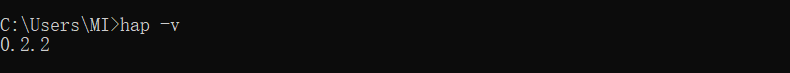
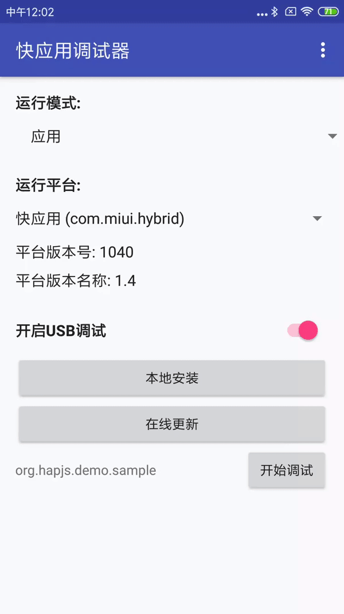

# Sample

[快应用](https://www.quickapp.cn/)官方示例项目

[![node version][node-image]][node-url]
[![hap-toolkit version][hap-toolkit-image]][hap-toolkit-url]
[](https://circleci.com/gh/quickappcn/sample)


[node-image]: https://img.shields.io/badge/node.js-%3E=_8-green.svg?style=flat-square
[node-url]: http://nodejs.org/download/
[hap-toolkit-image]: https://img.shields.io/badge/hap--toolkit-%3E=_0.6-blue.svg
[hap-toolkit-url]: https://www.npmjs.com/package/hap-toolkit

## 简介
2018年3月份，由小米，中兴，华为等10家厂商成立了快应用联盟，共同发布了快应用的标准。
自此我们可以采用一套标准去开发应用，无缝的运行在各个手机厂商上。一次开发，一次上传，自动分发到所有联盟厂商的设备

快应用官方是采用前端的技术栈来开发的，此项目为示例项目,帮助开发者快速入门快应用的开发

## 文档和社区

- [官方站点 && 文档](https://www.quickapp.cn/)
- [开发者论坛](https://bbs.quickapp.cn/)
- [issues](https://github.com/quickappcn/issues/issues)

## 快速开始

#### 安装hap-toolkit 编译工具

```bash
$ npm install -g hap-toolkit
$ hap -v
```

安装好hap-toolkit后，可以在控制台输入hap -v 看看当前的版本



#### 安装手机调试器

调试器是一个Android应用程序，下载[调试器APK](https://statres.quickapp.cn/quickapp/quickapp/201806/file/quickapp_debugger.apk)

**安装成功如图**


#### 项目运行

1. 在项目根目录,安装依赖
   ```bash
   $ npm install
   ```
2. 编译
    ```bash
    $ npm run build
    ```
3. 调试
    ```bash
    <!-- 修改源代码后自动编译 -->
    $ npm run watch
    ```
4. 启动http服务器
    ```bash
    $ npm run server
    ```
使用手机调试器调试

**效果预览**



**在线查看**

HTTPS形式的应用链接(`https://hapjs.org/app/org.quickapp.union.sample`)二维码：


HAP形式的应用链接(`hap://app/org.quickapp.union.sample`)二维码：

